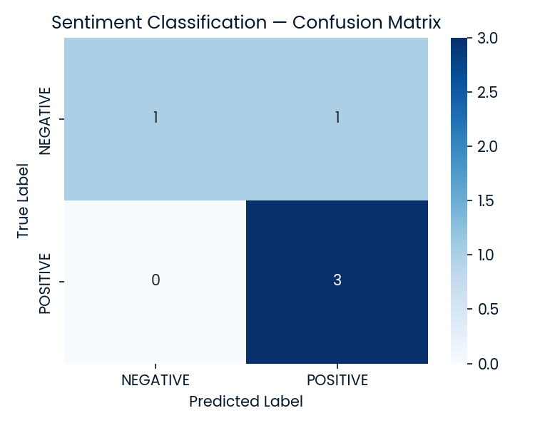
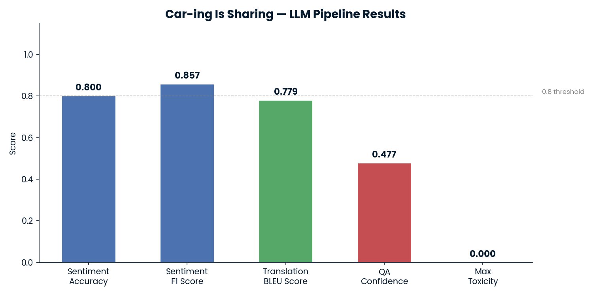

# Car-Review-LLM-Pipeline

An end-to-end NLP pipeline built for **Car-ing is Sharing**, a fictional car sales and rental company, to prototype AI-powered features using pre-trained Hugging Face LLMs. The pipeline processes real customer car reviews through four distinct language tasks, from sentiment classification to bias analysis.

---

## Problem Statement

Car dealerships collect massive amounts of unstructured text data from customer reviews but lack the tooling to act on it. This project demonstrates how pre-trained LLMs can be composed into a lightweight pipeline that extracts actionable insights: sentiment, translated content, direct answers to business questions, and concise summaries, without training a model from scratch.

---

## Tasks

| # | Task | Model Used |
|---|------|------------|
| 1 | Sentiment Classification | `distilbert-base-uncased-finetuned-sst-2-english` |
| 2 | English → Spanish Translation + BLEU | `Helsinki-NLP/opus-mt-en-es` |
| 3 | Extractive Question Answering | `deepset/minilm-uncased-squad2` |
| 4 | Summarization + Toxicity & Regard Bias Analysis | `facebook/bart-large-cnn` |

---

## Tech Stack

- **Language:** Python 3.10
- **LLM Framework:** Hugging Face `transformers`, `evaluate`
- **Data:** `pandas`
- **Metrics:** `scikit-learn` (accuracy, F1, confusion matrix), `evaluate` (BLEU, toxicity, regard)
- **Visualization:** `matplotlib`, `seaborn`

---

## Project Structure

```
Car-Review-LLM-Pipeline/
│
├── data/
│   ├── car_reviews.csv            # 5 labelled car reviews (POSITIVE/NEGATIVE)
│   └── reference_translations.txt # Reference Spanish translations for BLEU scoring
│
├── .gitignore
├── LICENSE
├── README.md
├── car.jpeg
├── car_llm_project.py             # Main pipeline script
├── confusion_matrix.png
├── notebook.ipynb
├── requirements.txt
└── results_dashboard.png
```

---

## How to Run

**1. Clone the repository**
```bash
git clone https://github.com/fahadelahikhan/Car-Review-LLM-Pipeline.git
cd Car-Review-LLM-Pipeline
```

**2. Install dependencies**
```bash
pip install -r requirements.txt
```

**3. Run the pipeline**
```bash
python car_llm_project.py
```

The script will sequentially run all four tasks and output:
- Printed metrics for each task
- `confusion_matrix.png` — Task 1 visual
- `results_dashboard.png` — Summary bar chart across all tasks

---

## Results

| Task | Metric | Value |
|------|--------|-------|
| Sentiment Classification | Accuracy | 0.8000 |
| Sentiment Classification | F1 Score | 0.8571 |
| Translation | BLEU Score | 0.7794 |
| Translation | Brevity Penalty | 1.0000 |
| Extractive QA | Answer | *ride quality, reliability* |
| Extractive QA | Confidence | 0.4774 |
| Summarization | Max Toxicity | 0.0001 |
| Summarization | Regard (Positive) | 0.6263 |

---

## Sample Outputs

**Task 2 — Translation**
> **Source:** "I am very satisfied with my 2014 Nissan NV SL. I use this van for my business deliveries and personal use."
>
> **Translation:** "Estoy muy satisfecho con mi Nissan NV SL 2014. Uso esta camioneta para mis entregas de negocios y uso personal."

**Task 3 — Question Answering**
> **Question:** What did he like about the brand?
>
> **Answer:** ride quality, reliability

**Task 4 — Summary**
> "The Nissan Rogue provides me with the desired SUV experience without burdening me with an exorbitant payment. Handling and styling are great; I have hauled 12 bags of mulch in the back with the seats down and could have held more."

---

## Key Technical Decisions

- **DistilBERT over BERT** for sentiment — 40% smaller, nearly identical accuracy on SST-2, fast enough for a demo pipeline
- **Smoothed BLEU via `evaluate`** — short sentences produce zero n-gram overlap without smoothing, which would misrepresent translation quality
- **Greedy decoding (`do_sample=False`)** in the summarizer — deterministic output keeps the 50–55 token window reproducible across runs
- **Toxicity + Regard** as a pair — toxicity catches harmful language while regard captures sentiment polarity toward demographic groups; together they give a more complete bias picture than either alone

---

## Output Visualizations

**Confusion Matrix (Task 1)**



**Results Dashboard**



---

## License

[MIT](LICENSE)
